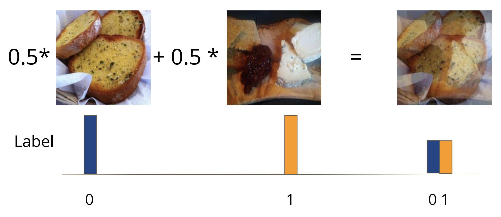
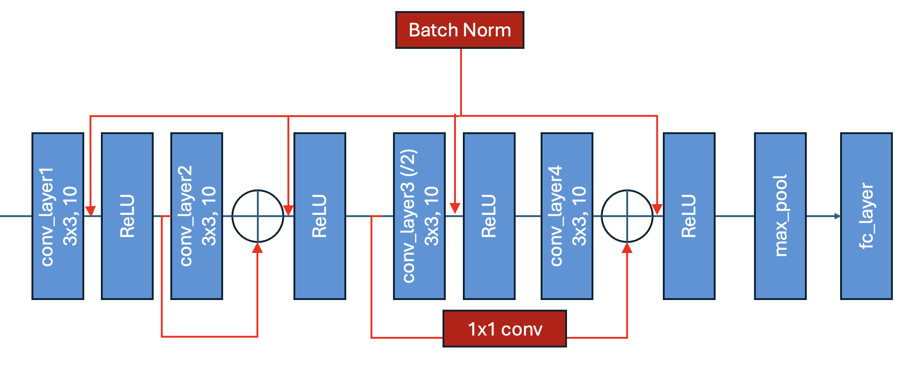

# Homework 7: First Contact with Neural Networks

The due date is April 10 at midnight. Please follow the [code squad rules](https://junwei-lu.github.io/bst236/chapter_syllabus/syllabus/#code-squad). If you are using the late days, please note in the head of README.md that "We used XX late days this time, and we have XX days remaining". 

The main purpose of this homework is to help you:

- Solve image classification with convolutional neural networks.
- Improve the performance with data augmentations.
- Understand popular image model techniques such as residual connections and batch normalization.
- Hyperparameter tuning using logging tools like tensorboard and wandb.
- GPU training on cluster.
- Join a Kaggle competition and submit your predictions.


In this homework, you need to fill in the missing code under `#TODO` in the python files in the `src` folder.  We will give specific instructions for each part. 

We suggest you to test your code on CPU first. If it runs correctly, then you can try to tune the hyperparameters, train the model, and test the model on the GPUs on the class cluster.

## Installation 

- Please ensure the following packages are installed (via pip): `tensorboard wandb torchvision`
- We have prepared a full `requirements.txt` file that has all the packages you should need to run the code on the cluster
- After creating virtual environment `venv` and activating it, you can install the packages with `pip install -r requirements.txt`.
- On a newer version of python you may run `pip install -r requirements.txt --use-deprecated=legacy-resolver`
- Create an account at [wandb](https://wandb.ai/site/), please use your Harvard email, choosing the academic account type. It will provide an API key that you will need to save to do the assignment. 

## Problem: CIFAR-10 Classification with Convolutional Neural Networks

In this problem, you will build a convolutional neural network for the CIFAR-10 dataset. 

We have provided most of the infrastructure code for you. Please first understand (with the help of copilot) the code infrastructure:

-  Custom Cifar10 data class in `src/dataset.py` defines the dataset 
-  TinyVGG_Residual class in `src/model.py` defines the model for training
- `Trainer` in `src/train.py` defines the training loop
- `src/utils.py` defines utility functions.
- `src/config.py` defines the configuration for the hyperparameters.
- `src/train.py` is the main file to run the training.

### Problem 1.1: Data Augmentation using Mixup

Mixup is a simple yet effective data augmentation technique that creates new training examples by linearly interpolating between pairs of images and their labels. For each training image, we randomly select another training image and blend them together using a weighted average $\lambda$.



For example, from the above figure, if we have two training images $x_1$ and $x_2$, and their one-hot encoded labels $y_1 = [1, 0, 0]$ and $y_2 = [0, 1, 0]$, we can create a new training example by blending them together using a weighted average $\lambda = 0.5$:

$$
x' = \lambda x_1 + (1-\lambda) x_2
$$

$$
y' = \lambda y_1 + (1-\lambda) y_2
$$


In our implementation, we will use a fixed $\lambda=0.5$ with a 40% probability (`self.mixup_prob=0.4` in `src/dataset.py`) of applying mixup to any given sample, and a 60% probability of using the original transformed image without mixup.

You need to do the following tasks:

- Add more built-in data augmentation methods in `self.transform` in the beginning of the `__init__` function of `CustomCIFAR` class in `src/dataset.py` for training set.

- Fill in the missing code in `src/dataset.py` by implementing the `__getitem__` function of `CustomCIFAR` class to implement the mixup data augmentation. The function should `return tensor_img, label_onehot` where `tensor_img` is the mixed image $x'$ and `label_onehot` is the mixed label vector $y'$.

Once you have finished this. You can try to run the `src/dataset.py` to check the visualization of the mixed images.

- The `nn.CrossEntropyLoss` function in `src/train.py` is not suitable for mixup data augmentation. You need to implement a new loss function `MixupCrossEntropyLoss` in `src/train.py` that takes both the model output logits $o$ with the softmax applied $y = \text{softmax}(o)$ and the mixed labels $y'$ as input, and the loss using the mixed labels with $N$ classes: 

$$
\text{Mixup Loss} = -\sum_{i=1}^{N} y'_i \log y_i
$$

Notice you `MixupCrossEntropyLoss` needs to inherit from `nn.Module` and implement the loss computation in the `forward` function which takes the average of the loss over all the samples in the batch.

### Problem 1.2: Residual Connection

Implement Residual Connections in the `TinyVGG_Residual` model, following the
graph below.



Add a batch normalization layer after every convolutional layer (and after the residual addition) in the `TinyVGG_Residual` model.

Once you have finished this. You can try to run the `src/model.py` to test.

You can also test if you can train your model by the command

```bash
python3 src/train.py --debug_mode True
```

### Problem 1.3: Hyperparameter Tuning

The code `src/run_hyperparam_tuning.py` contains code that trains the model for three different values of the learning rate. At a minimum, please run this code and report your results, or also increase the number of learning rates or number of epochs considered to try to find the best model. A slurm script `src/slurm_tuning.sh` is provided that will allow you to run the hyperparameter tuning on the course cluster, using `sbatch`. Running this should take around 60 minutes for the default parameters. It is fine to use a smaller number of epochs (20) in this step. 

You can modify the code to improve the GPU training efficiency using the tips learned in the class. 

Run the `src/run_hyperparam_tuning.py` to do the hyperparameter tuning with learning rate. Use wandb and tensorboard to monitor the training process.


### Problem 1.4: Evaluate the Model on Kaggle

Choose the best hyperparameters, set them in `src/config.py`, and train the model by running `python3 src/train.py`. Use 300 epochs for the final training. Save checkpoint every a few epochs and best model. Evaluate the model on the test set using `python3 src/test.py`. You need to specify the checkpoint path of the model you want to test in `src/test.py`. Report the testing error, check those misclassified samples and report any pattern you discover.

Next is to evaluate your model on [Kaggle CIFAR-10 competition](https://www.kaggle.com/c/cifar-10). Your squad should register a [Kaggle account](https://www.kaggle.com/#) and join the CIFAR-10 competition. Read the [Kaggle API tutorial](https://www.kaggle.com/docs/api) and [Kaggle Competition tutorial](https://www.kaggle.com/docs/competitions-setup) for more details. In specific, you need to do the following tasks:

- Register a Kaggle account and join the [CIFAR-10 competition](https://www.kaggle.com/c/cifar-10).
- Install [kaggle api](https://www.kaggle.com/docs/api): `pip install kaggle`
- Download the data: `kaggle competitions download -c cifar-10`
- Unzip the testing data: `unzip cifar-10.zip`
- The test data is in a `.7z` file. On Mac, you can run `brew install p7zip` and then `7z x test.7z -o./cifar-10/` to extract the data. 
- Use `src/test_kaggle.py` to read the testing images and ids from the testing data in `cifar-10/test` and choose your best model checkpoint to make predictions and save your predictions to a `kaggle_submission.csv` file.
- Submit your predictions to the kaggle competition by `kaggle competitions submit -c cifar-10 -f results/kaggle_submission.csv -m "message"`
- Find and report your score on Kaggle website and your rank on the leaderboard.


### Problem 1.5: Summarize Your Results

Use logging information from the tensorboard or wandb to summarize all the results about the hyperparameter tuning final training and testing performance. Based on your training experience, write some good practices for deep learning model training for checking the code correctness, minitoring the training performance, and make your training process reproducible, robust, efficient, and transferable.

It is not required but we also provide the code `src/activation_maximization.py` for interpreting the model. You need to specify the checkpoint path of the model you want to interpret in `src/activation_maximization.py`. Also you need to choose better hyperparameters in `src/activation_maximization.py` to generate better results.
Given an image input $x$, denote our model logit output as $f(x)$, the activation maximization problem is to find an image $x'$ that maximizes the activation of a specific class $c$, i.e., the $c$-th entry of the logit output $f(x)$:

$$
x^*_c = \text{argmax} f_c(x) - k TV(x)
$$

where $TV(x)$ is the total variation of $x$ and $k$ is a weight parameter (`tv_weight` in `src/activation_maximization.py`). Then $x^*_c$ is like the "canonical" image for class $c$ that maximally activates the class $c$.


